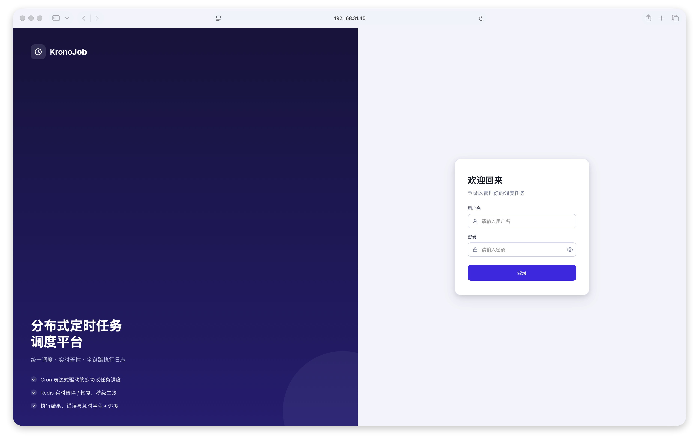
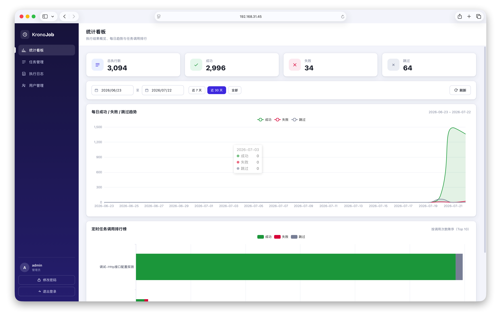
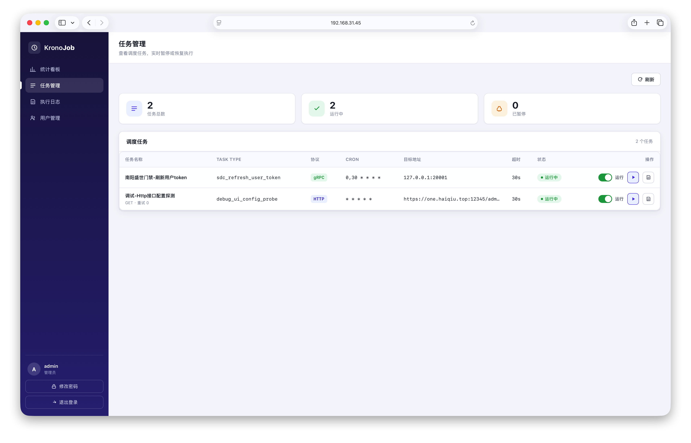
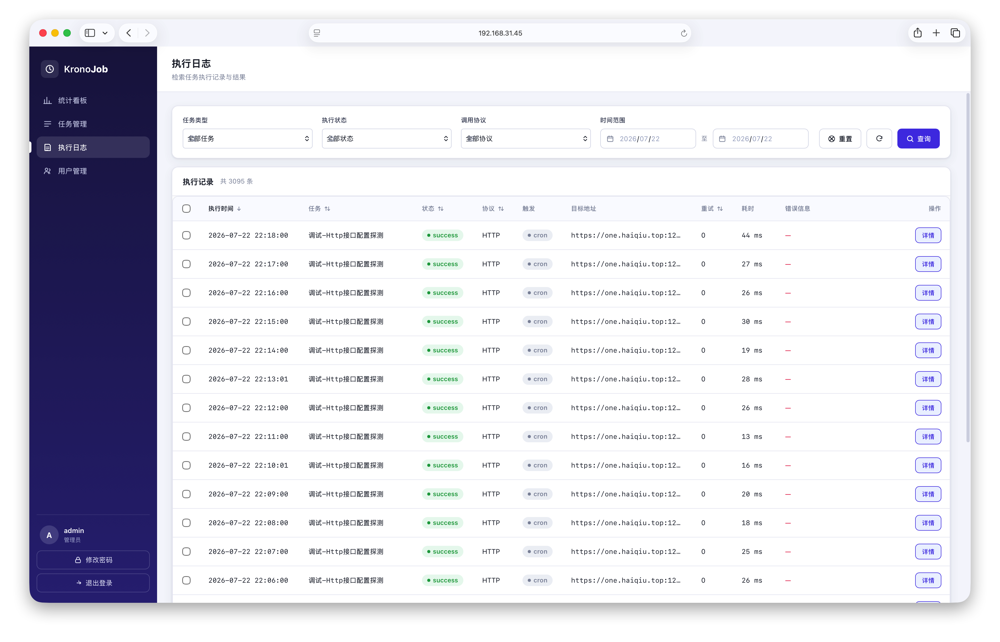
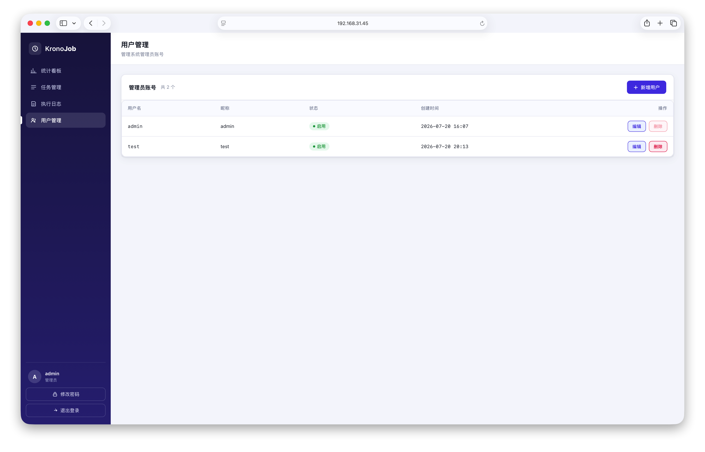

# krono-job 界面截图与功能说明

本文档汇总 krono-job 管理后台（Vue3 前端）的界面截图，并对每个页面做简要功能说明。
所有截图位于本目录（`docs/images/`），对应的页面位于 `web/src/views/`。

> 平台默认访问地址：`http://localhost:10010`（Docker 单镜像或本地 `go run` 启动后一致）。

---

## 1. 登录页（Login）

- 路径：`/login`，对应视图 `LoginView.vue`。
- 品牌双栏布局：左侧品牌/标语，右侧账号密码表单。
- 提交后调用 `POST /api/auth/login`，成功返回 `token` 与用户信息并写入 Pinia 鉴权 store，随后跳转至仪表盘。
- 路由守卫：未携带有效 `Bearer Token` 访问受保护页面会自动重定向回登录页。
- 默认管理员账号来自环境变量 `KRONO_BOOTSTRAP_ADMIN_USER` / `KRONO_BOOTSTRAP_ADMIN_PASS`（镜像内置默认 `admin` / `admin123`，生产务必修改）。

---

## 2. 仪表盘（Dashboard / 统计概览）

- 路径：`/stats`，对应视图 `StatsView.vue`，登录后默认落地页。
- 顶部概览卡片：总执行数、成功、失败、跳过四项实时汇总。
- 时间范围筛选：支持自定义起止日期，并提供「近 7 天 / 近 30 天 / 全部」快捷区间与刷新按钮。
- **每日趋势图**：以折线图展示所选时间范围内每日的成功 / 失败 / 跳过趋势（缺失日期自动补零，保证曲线连续）。
- **定时任务调用排行榜**：横向堆叠条形图，按调用次数降序展示 Top 10 任务的成功 / 失败 / 跳过分布。
- 图表基于 ECharts 渲染，含骨架屏加载态。

---

## 3. 任务管理（Jobs）

- 路径：`/jobs`，对应视图 `JobsView.vue`。
- 展示 `jobs.yaml` 中声明的全部定时任务（HTTP / gRPC 协议），列表含任务名、协议类型、`cron` 表达式、目标端点、启用态与暂停态。
- **暂停 / 恢复**：每行提供开关控件，调用 `POST /api/jobs/:task_type/pause` 或 `.../resume`，暂停态写入 Redis Set `krono:paused_tasks`，Worker 分发前拦截（命中则本次调度落库 `skipped`）。
- **立即执行**：「立即执行」按钮调用 `POST /api/jobs/:task_type/run`，将任务以 `trigger_type='manual'` 立即投递到 Asynq 队列（绕过暂停态，必定执行），投递后给出提示，结果可在执行日志页查看。
- **查看日志**：可一键跳转执行日志页，并预选该任务的 `task_type` 进行过滤。
- 任务定义由 `configs/jobs.yaml` 声明式维护，支持 fsnotify 热重载，无需重启平台。

---

## 4. 执行日志（Logs）

- 路径：`/logs`（详情 `/logs/:id`），对应视图 `LogsView.vue` / `LogDetailView.vue`。
- 分页表格展示 `job_exec_log` 表记录：任务类型、触发方式（`cron` / `manual`）、协议、目标端点、状态（成功 / 失败 / 跳过）、重试次数、耗时、起止时间等。
- 多维过滤：支持按 `task_type`、`status`、`protocol`、时间区间筛选，并可按字段排序。
- 点击单行可进入 **日志详情页**，查看完整响应体（`response_body`，超 8KB 截断）与错误信息（`error_msg`）。
- 数据来自 `GET /api/logs`（分页 + 过滤 + 排序）。

---

## 5. 用户管理（Users）

- 路径：`/users`，对应视图 `UsersView.vue`。
- 管理员用户（`sys_user` 表）的增删改查：用户名、昵称、状态（启用 / 禁用）、创建/更新时间。
- 支持新增用户（含密码设置）、编辑（昵称 / 状态 / 改密）、删除。
- 安全约束：当前登录用户不可删除或禁用自己（前端基于 `auth.user.id` 禁用对应操作）。
- 密码以 bcrypt 哈希存储。

---

## 页面总览

| 页面 | 路由 | 视图文件 | 核心能力 |
| --- | --- | --- | --- |
| 登录 | `/login` | `LoginView.vue` | JWT 登录、路由守卫 |
| 仪表盘 | `/stats` | `StatsView.vue` | 概览卡片、每日趋势、任务排行榜 |
| 任务管理 | `/jobs` | `JobsView.vue` | 暂停/恢复、立即执行、查看日志 |
| 执行日志 | `/logs` | `LogsView.vue` / `LogDetailView.vue` | 分页、过滤、排序、详情 |
| 用户管理 | `/users` | `UsersView.vue` | 用户增删改查、状态管理 |
